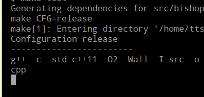

# Introduction

This is a C++11 implementation of a solver for the
*swapping bishops* puzzle. Basically, two white and
two black bishops are placed on a 4x5 board, and must
be moved so that eventually they swap places.

The bishops move the same way they move in chess,
(i.e. diagonally, and can't jump over other bishops)
and they can't be placed in a tile threatened by
any bishop of the other colour.

I found this puzzle in a game I installed on my Android tablet
(called *MindGames*) and couldn't resist writing a solver for it :-)

# Compilation and running

Just...

        make test

You'll see it solve and print the solution:

If you want to benchmark 100 executions of the algorithm:

        make benchmark

The code is extensively commented, and is a pretty simple
implementation of a [http://en.wikipedia.org/wiki/Breadth-first_search](Breadth-First-Search)
algorithm, searching the board space.

Enjoy!
